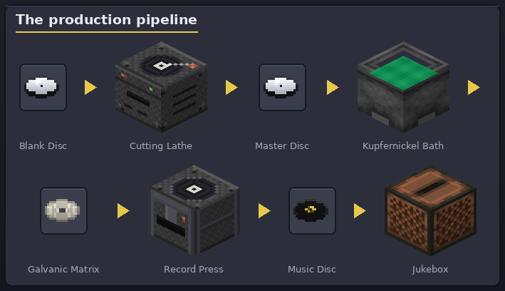

<p align="center">
  
</p>

# Custom Disc Maestro

[](https://github.com/hiimluck3r/custom-disc-maestro/actions/workflows/build.yml)
[](https://hiimluck3r.github.io/custom-disc-maestro/)
[](LICENSE)
[](https://www.minecraft.net/)
[](https://neoforged.net/)

A NeoForge mod for **Minecraft 1.21.1** that turns making music discs into a hands-on manufacturing
pipeline — the way real vinyl is made (well, almost). Compose a tune in the piano-roll sequencer (or import a
`.nbs` file), cut it to a **master disc**, grow a **galvanic matrix** in a poisonous kupfernickel
bath, **press** dyed records with album-cover sleeves — and mind the groove wear: discs degrade as
they play. All audio uses Minecraft's own note-block sounds; multiplayer-safe and positional.



## 📖 Documentation

The full illustrated guide (crafting, every pipeline step, server configuration) lives on
**GitHub Pages**:

- **[Guide in English](https://hiimluck3r.github.io/custom-disc-maestro/)**
- **[Руководство на русском](https://hiimluck3r.github.io/custom-disc-maestro/ru/)**

> Мод превращает создание пластинок в производственный конвейер: секвенсор → мастер-диск →
> гальваническая матрица → пресс → конверт. Пластинки изнашиваются от проигрывания, запас прочности
> настраивается на сервере. Полное руководство — по ссылке выше.

The site (including every image, rendered from the mod's actual textures) is rebuilt automatically
by [`docs.yml`](.github/workflows/docs.yml) on each push.

## Installation

1. Install [NeoForge **21.1.228**](https://neoforged.net/) for Minecraft **1.21.1**.
2. Drop the mod JAR into your `mods/` folder — grab it from
   [Releases](https://github.com/hiimluck3r/custom-disc-maestro/releases).
3. Launch the game.

## Building from source

Requires a full **JDK 21** (a JRE is not enough — NeoForm recompiles Minecraft).

```bash
./gradlew build          # output: build/libs/cdm-<version>.jar
./gradlew runClient      # launch the dev client
./gradlew runData        # regenerate data/asset JSONs (src/generated)
python docs/tools/render_images.py   # re-render the documentation images
```

## Versioning

Releases follow `MAJOR.MINOR.PATCH` and are tagged `vX.Y.Z`; see [CHANGELOG.md](CHANGELOG.md).
Each Minecraft version lives on its own branch (e.g. `1.21.1`); `master` tracks the latest.

## License

Released under the [MIT License](LICENSE) — free to use, modify, fork and redistribute, including in
modpacks. Attribution is appreciated but not required.
