# Custom Disc Maestro — руководство

Мод на NeoForge, который превращает создание пластинок в настоящий производственный процесс — так,
как делают винил в реальности. Сочините мелодию, нарежьте её на
мастер-диск, вырастите гальваническую матрицу в ядовитой изумрудной ванне, отпрессуйте тираж,
покрасьте оформление и упакуйте релиз в конверт. Пластинки изнашиваются от проигрывания — а ещё их
можно состарить нарочно.

Весь звук идёт через **нотные блоки Minecraft** — никаких сторонних аудиомодов и загрузки файлов,
полная поддержка мультиплеера, звук позиционный.

!!! note "Примечание"
    Все иллюстрации собраны из настоящих текстур мода скриптом
    [`docs/tools/render_images.py`](https://github.com/hiimluck3r/custom-disc-maestro/blob/master/docs/tools/render_images.py).

## Возможности

- **Встроенный секвенсор** («пиано-ролл»: 16 инструментов нотного блока, BPM 40–300, рисование
  нот перетаскиванием) и **импорт файлов Note Block Studio (`.nbs`)**.
- Настоящая производственная цепочка: **мастер-диск → гальваническая матрица → прессованная
  пластинка**, каждый шаг на своей станции.
- **Красящиеся пластинки**: цвет винила, цвет этикетки и штампованный узор.
- **Износ**: каждое проигрывание стирает канавку; на 50% / 75% / 100% износа пластинка пропускает
  ноты, фальшивит и в конце играет с сильными искажениями и выглядит расколотой. Изношенный мастер
  передаёт износ всем копиям. Запас прочности **настраивается на сервере**.
- **Намеренное царапание** на столе кузнеца.
- **Конверты с поведением бандла** — оформление в духе настоящих обложек, вставленная пластинка
  выглядывает из конверта, а многоразовые **трафареты** тиражируют обложки.
- Проигрывание в **ванильном проигрывателе**, позиционно, с метаданными в «Сейчас играет».

## Прохождение

### 1. Постройте три стола

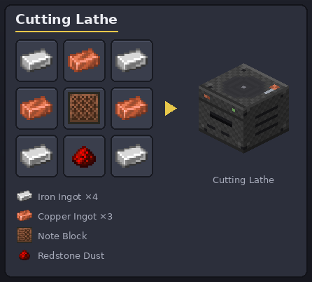

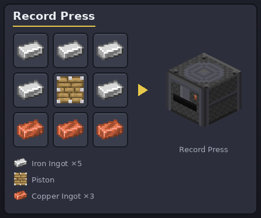

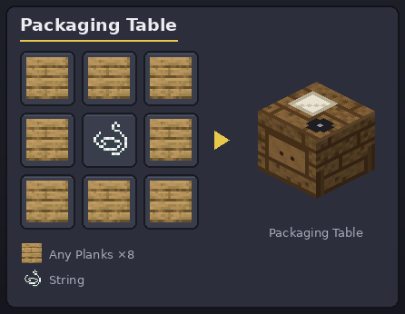

Все три поворачиваются лицом к вам при установке, как печь. На станке и прессе сверху виден диск,
пока он внутри.

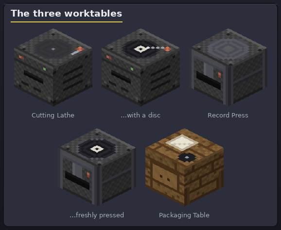

### 2. Скрафтите заготовку диска

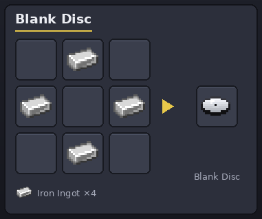

Четыре железных слитка ромбом — одна **заготовка диска**, будущий мастер.

### 3. Сочините и нарежьте мастер-диск

ПКМ по **станку для нарезки** — откроется редактор:

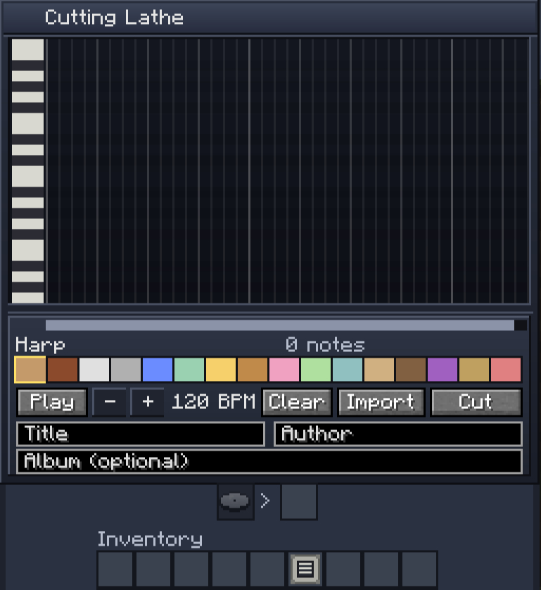

- Сетка — это **пиано-ролл**: столбцы — шаги времени, строки — высота ноты (слева клавиши).
  **Клик** ставит ноту, повторный клик убирает, **перетаскивание** рисует линию нот.
- **16 инструментов** выбираются в цветной палитре (у каждого свой цвет на сетке).
- Настройте **BPM** (40–300, кнопки −/+ можно держать), прослушайте через **Играть**, заполните
  **Название / Автора / Альбом** — они попадут в подсказку пластинки и в «Сейчас играет».
- **Импорт** читает файл **Note Block Studio `.nbs`** (до 8192 нот / 20 минут; нестандартные
  инструменты NBS заменяются ближайшими ванильными).
- Положите **заготовку диска** во входную ячейку и нажмите **Нарезать** — получите **мастер-диск**
  (в подсказке помечен как «Мастер-диск»).

Мастер можно слушать сразу, но каждое проигрывание изнашивает его, а копии наследуют износ — так
что сначала отпрессуйте тираж!

### 4. Сварите купферникелевую ванну

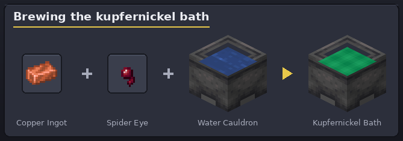

Бросьте (++q++) **медный слиток** и **паучий глаз** в **котёл с водой**. Смесь зашипит и
превратится в изумрудный **купферникель**. Его можно зачерпнуть ведром, вылить обратно и даже
разлить в мире — но **не купайтесь в нём: он накладывает иссушение**.

### 5. Вырастите гальваническую матрицу

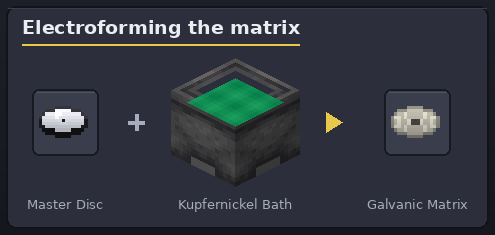

ПКМ мастер-диском по котлу с купферникелем — ванна вырастит **гальваническую матрицу**, металлический
негатив вашего трека. Мастер остаётся у вас; уровень ванны падает на один. Одна матрица выдерживает
**3 прессовки** (настраивается администратором). Если мастер уже был изношен, матрица «запекает» его
износ — все её копии будут заранее поцарапаны (как в жизни!).

Гальванопластика работает только с **мастер-дисками** — прессованную пластинку обратно в матрицу не
превратить.

### 6. Отпрессуйте пластинки

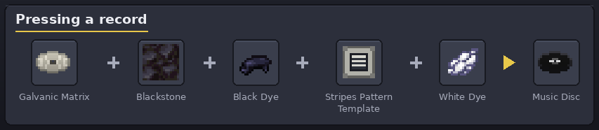

В **прессе** разложите:

| Ячейка | Предмет | Обязательно? |
|--------|---------|--------------|
| Матрица | ваша гальваническая матрица | да |
| Чернит | 1 на пластинку (сырьё) | да |
| Краситель пластинки | любой краситель — цвет корпуса | нет (по умолчанию чёрная) |
| Узор | шаблон узора (полосы / лента / горошек) | нет (по умолчанию без узора) |
| Краситель этикетки | любой краситель — цвет этикетки/узора | нет (по умолчанию белая) |

Нажмите **Прессовать**: красители и шаблон расходуются, матрица теряет одно использование, готовая
пластинка появляется в ячейке вывода (и ложится на платен пресса). Предпросмотр показывает результат
заранее.

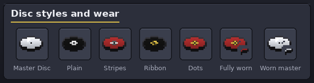

### 7. Слушайте — и следите за износом

Любой **проигрыватель** играет ваши пластинки позиционно для всех вокруг. Каждое проигрывание — одно
очко из запаса прочности (по умолчанию **32 проигрывания** и у мастера, и у прессованной пластинки;
администратор может изменить — см. [Настройки сервера](#server-config)). Искажения включаются по
**проценту износа** при любом запасе:

- до **50%** — чистый звук;
- **50%+** — редкие пропуски нот и лёгкая фальшь;
- **75%+** — чаще и сильнее;
- **100%** — полностью изношена: сильные искажения и расколотая текстура (цвета и узор остаются
  видны на осколках).

Хотите состаренный звук нарочно? **Поцарапайте** пластинку на **столе кузнеца**: `кремень +
пластинка + кремень` — износ прыгает на следующую ступень (50% → 75% → 100%).

### 8. Упакуйте релиз

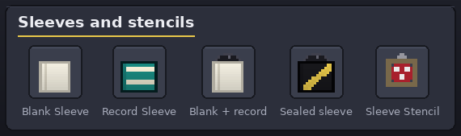

- **Чистый конверт** крафтится из 8 бумаги (кольцом, как сундук).

    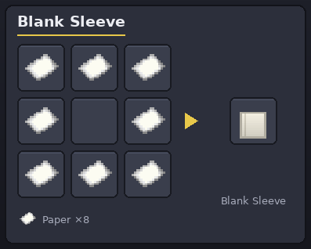

- **Оформите** его на упаковочном столе: краситель обложки + шаблон узора + краситель наклейки +
  название, с живым предпросмотром. «Применить» расходует материалы.
- **Конверт ведёт себя как бандл.** В любом инвентаре возьмите конверт на курсор и **кликните ПКМ по
  пластинке** (или пластинкой по конверту) — она спрячется внутрь; **ПКМ заполненным конвертом по
  пустой ячейке** — пластинка выедет обратно. ПКМ заполненным конвертом в руке — **выбросит
  пластинку на землю**. Из заполненного конверта **выглядывает край пластинки**. (Через верстак
  тоже можно: конверт + пластинка соединяются; заполненный конверт разбирается обратно.)
- Конверт с пластинкой внутри **запечатан** — оформление заблокировано, пока не вынете пластинку.
- **Тиражируйте обложки**: превратите оформленный конверт в многоразовый **трафарет** (конверт
  расходуется), затем крафтите `трафарет + N чистых конвертов` → N оформленных; трафарет каждый раз
  возвращается.

### Откуда берутся шаблоны узоров?

Когда **скелет убивает другого скелета**, жертва всегда роняет случайный **шаблон узора** (полосы,
лента или горошек). Устройте им дуэль. Любой шаблон дублируется крафтом `шаблон + алмаз` → 2 шаблона.

## Настройки сервера { #server-config }

Администратор настраивает конвейер в серверном конфиге — `config/cdm-server.toml` на выделенном
сервере, `<мир>/serverconfig/cdm-server.toml` в одиночной игре (можно и через игровой экран настроек
мода). Значения применяются к предметам, **созданным после изменения**; уже существующие диски
сохраняют свой запас. Искажения звука всегда начинаются на 50% / 75% / 100% износа.

| Параметр | По умолчанию | Значение |
|----------|--------------|----------|
| `uses.masterUses` | **32** | Сколько проигрываний выдерживает свеженарезанный мастер-диск |
| `uses.recordUses` | **32** | Сколько проигрываний выдерживает прессованная пластинка |
| `uses.matrixUses` | **3** | Сколько пластинок прессует одна гальваническая матрица |

## Установка

1. Установите [NeoForge](https://neoforged.net/) под вашу версию Minecraft.
2. Положите JAR мода в папку `mods/` — на странице
   [Releases](https://github.com/hiimluck3r/custom-disc-maestro/releases) выберите сборку под вашу
   версию Minecraft (каждая поддерживаемая версия живёт в своей ветке).
3. Запустите игру.
